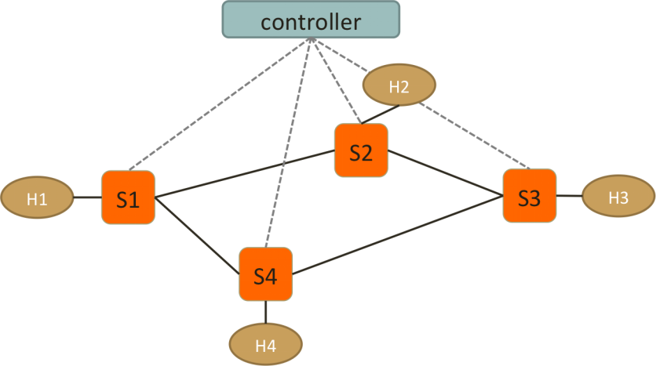

# Simulated_SDN: A Ryu-based Software-Defined Networking Application

This project implements a policy-aware SDN (Software Defined Networking) application using the [Ryu Controller](https://osrg.github.io/ryu/). It supports dynamic topology discovery, shortest path forwarding, protocol-based forwarding (ARP, ICMP, TCP, UDP), access control, and custom routing policies in a simulated OpenFlow network.

## 🔐 Policy Logic

This controller enforces the following forwarding and filtering policies:



0. **Configuration**
   H1: IP address:10.0.0.1, MAC address: 10:00:00:00:00:01;
   H2: IP address:10.0.0.2, MAC address: 10:00:00:00:00:02;
   H3: IP address:10.0.0.3, MAC address: 10:00:00:00:00:03;
   H4: IP address:10.0.0.4, MAC address: 10:00:00:00:00:04;

1. **Shortest Path Routing**  
   All traffic follows the shortest path computed from the current topology graph.

2. **Handling Equal-Cost Multi-Paths (ECMP)**  
   When multiple shortest paths exist:
   - **ICMP & TCP** packets take the **clockwise path**  
     e.g., S1 → S2 → S3 or S2 → S3 → S4
   - **UDP** packets take the **counterclockwise path**  
     e.g., S1 → S4 → S3 or S2 → S1 → S4

3. **Block HTTP Traffic from H2 and H4**  
   - Any new TCP connection from **H2 (10.0.0.2)** or **H4 (10.0.0.4)** to port 80 is dropped.
   - A TCP RST packet is created and sent back to the host as a response.
   - This applies only to the first TCP SYN packet of a connection.

4. **Drop UDP Traffic from H1 and H4**  
   - Any UDP packets originating from **H1 (10.0.0.1)** or **H4 (10.0.0.4)** are silently dropped at the switch.

5. **ARP Handling**  
   - Hosts are dynamically registered in the topology graph upon ARP discovery.
   - ARP requests are forwarded along shortest paths or flooded if destination is unknown.


## 🔧 Features and Tools

- **Dynamic Topology Discovery**  
  Uses `networkx` to dynamically build and update the network graph from switch and link events.

- **Protocol-Aware Flow Management**  
  Handles forwarding logic based on packet types: ARP, ICMP, TCP, and UDP.

- **Access Control**  
  Blocks HTTP traffic (`TCP dst port 80`) from specific hosts and sends TCP RST packets.

- **Directional Path Routing**  
  Implements clockwise or counterclockwise routing for ICMP/UDP traffic based on source/destination.

- **Flow Installation**  
  Proactively installs flow rules to switches to reduce future controller involvement.

## 🧠 Application Logic Overview

- `EventSwitchEnter`: Updates the topology graph using link and switch info.
- `EventOFPPacketIn`: Handles incoming packets and dispatches to different handlers.
- `arp()`: Handles ARP packet forwarding and flow installation.
- `icmp_tcp()`: Processes ICMP and TCP packets, enforces policies like blocking HTTP access.
- `udp()`: Custom routing logic for UDP packets, with selective dropping of packets from certain hosts.
- `send_tcp_rst()`: Constructs and sends TCP RST packets to block connections.
- `AddHost()`: Adds a host node to the network graph for accurate path computation.

## 🚀 Getting Started

### 1. Requirements

- Python 3.6+
- Ryu (tested with version 4.34+)
- NetworkX
- mininet

### 2. Run with Mininet
- Start a Mininet topology (e.g., a simple ring or mesh):
```bash
sudo mn --custom topo.py --topo mytopo --controller remote
```
- Start remote Ryu controller
```bash
ryu-manager controller.py --observe-links
```

## 📌 Notes
Lab project of NYU Data Center and Cloud Computing: LabsInstructor: H. Jonathan Chao
